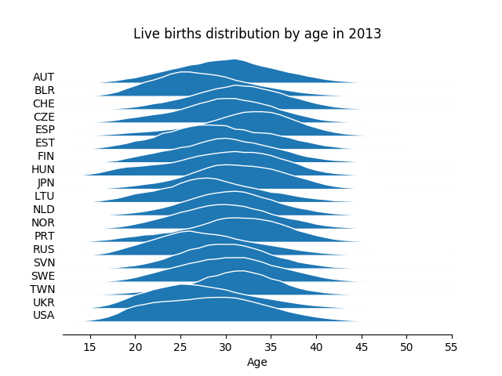

pyjoyplot using matplotlib
---

Joyplots are awesome! 
Joyplot is the term recently coined for similar plots to the famous Joy Division album cover.

Check the original post in [/r/dataisbeautiful/](https://www.reddit.com/r/dataisbeautiful/comments/6m0wo7/peak_time_for_sports_and_leisure_oc/)

Joyplots have been done in [R](https://github.com/halhen/viz-pub/blob/master/sports-time-of-day/2_gen_chart.R)
and [Excel](http://chandoo.org/wp/2017/07/12/joyplot-in-excel/)

This is one implementation for joyplots in python using matplotlib.

https://eagereyes.org/blog/2017/joy-plots

Birth rate data taken from [The Human Fertility Database](http://www.humanfertility.org/)

License
---
CC0

Use in any way you please
